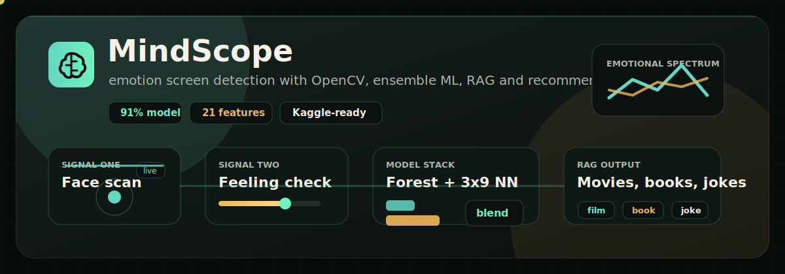

# MindScope Emotion Screen Detection

<p align="center">
  
</p>

<p align="center">
  <b>OpenCV face scan</b> | <b>question fallback</b> | <b>Random Forest clustering</b> | <b>3x9 neural network</b> | <b>local RAG recommendations</b>
</p>

MindScope is a dark themed emotion-screening prototype that scans a browser camera frame burst, blends facial cues with feeling-check answers, searches a local vector store, and recommends movies, books, or jokes based on the detected emotional state.

> This is an assistive wellness prototype, not a diagnosis or clinical mental-health assessment.

## Highlights

- Multi-frame OpenCV face cue extraction from the browser camera.
- Questionnaire fallback when face detection is weak, missing, or uncertain.
- Synthetic multi-source emotion-pattern datasets for first-pass training.
- Optional Kaggle FER2013 CSV import for real facial-expression examples.
- Random Forest leaf-signature clustering for emotion and feeling division.
- Neural network with 3 hidden layers of 9 neurons each.
- ExtraTrees and Gradient Boosting models inside a validation-weighted ensemble.
- Engineered interaction features for stress-brow coupling, withdrawal, calm balance, expression intensity and mixed emotional states.
- Calibrated confidence, model agreement, probability margin and signal-quality reporting.
- Local RAG/vector search over emotion notes, book-informed emotion knowledge, movies, books and jokes.
- React/Vite dark UI with SEO metadata.

## Live Pipeline

```text
Camera frames
  -> OpenCV facial cues
  -> engineered emotion features
  -> Random Forest + ExtraTrees + Gradient Boost + 3x9 NN
  -> cluster, confidence, uncertainty
  -> local RAG vector search
  -> movie, book and joke recommendations

If face signal is weak:
  -> feeling-check questions
  -> behavior features
  -> fused analysis
```

## Project Folder

```powershell
G:\emotion-screen-detection-rag
```

## Quick Start

Install and train the local artifacts:

```powershell
cd G:\emotion-screen-detection-rag
.\scripts\setup.ps1
```

Open two PowerShell terminals:

```powershell
.\scripts\start-api.ps1
```

```powershell
.\scripts\start-ui.ps1
```

Then open:

```text
http://127.0.0.1:5173
```

## API

| Method | Endpoint | Purpose |
| --- | --- | --- |
| `GET` | `/api/health` | Returns model metrics, feature names, model weights and training status. |
| `GET` | `/api/questions` | Returns fallback emotion questions. |
| `POST` | `/api/analyze` | Accepts `{ image, images, answers }` and returns emotion, confidence, uncertainty, cluster, RAG context and recommendations. |
| `POST` | `/api/train` | Retrains the model stack and vector store. |
| `POST` | `/api/rag/search` | Searches the local vector store. |

## Dataset Layer

The starter datasets are stored in `backend/data`:

| File | Role |
| --- | --- |
| `emotion_patterns.json` | Synthetic facial-action, questionnaire-behavior and mixed-context seed data. |
| `question_bank.json` | Feeling questions mapped to model features. |
| `rag_knowledge.json` | Retrieval context for emotion patterns. |
| `emotion_books_knowledge.json` | Paraphrased book-informed emotion concepts for RAG. |
| `recommendations.json` | Movies, books and jokes matched to emotional states. |
| `custom_emotion_samples.template.csv` | Template for adding your own labeled examples. |

For better real-world accuracy, extend the synthetic seeds with licensed real datasets such as FER-style facial expression CSVs, AffectNet-style labels, or your own consented survey data. Keep personally identifiable data out of the repository.

## Kaggle FER2013 Import

The app can import Kaggle FER2013-style CSV files with columns like `emotion,pixels,Usage`. It expects 48x48 grayscale pixel strings.

Automatic download, if Kaggle CLI and credentials are configured:

```powershell
.\scripts\import-kaggle-fer2013.ps1
.\scripts\setup.ps1
```

Manual fallback:

```powershell
mkdir backend\data\kaggle
copy C:\path\to\fer2013.csv backend\data\kaggle\fer2013.csv
.\scripts\setup.ps1
```

FER label mapping:

```text
angry/disgust -> angry
fear          -> fearful
happy         -> happy
sad           -> sad
surprise      -> surprised
neutral       -> calm
```

## Custom Samples

Add your own labeled examples:

```powershell
copy backend\data\custom_emotion_samples.template.csv backend\data\custom_emotion_samples.csv
```

Edit `backend\data\custom_emotion_samples.csv`, then retrain:

```powershell
.\scripts\setup.ps1
```

You can also use the in-app `Train` button after the API is running.

## Accuracy Notes

The current score is validation accuracy on the starter dataset. It is useful for development feedback, but it is not proof of clinical accuracy. The app is stronger than a single-frame prototype because it:

- averages several camera frames,
- fuses face and questionnaire evidence,
- uses a weighted model stack,
- reports confidence only with margin, agreement and signal-quality context,
- asks follow-up questions when the visual signal is weak.

## Stack

| Layer | Tools |
| --- | --- |
| Frontend | React, Vite, lucide-react, dark responsive UI |
| API | Flask |
| Vision | OpenCV-style facial cue extraction |
| ML | Random Forest, ExtraTrees, Gradient Boosting, MLP 3x9 neural network |
| RAG | Local vector store over emotion notes, recommendations and book-informed context |
| Data | Synthetic starter data, custom CSV, optional Kaggle FER2013 import |

## Safety

MindScope should be treated as a learning and wellness-assistive prototype. It should not be used as a medical, psychological, hiring, legal, school-discipline, policing or high-stakes decision tool without professional review, informed consent, bias testing and privacy controls.

## Suggested GitHub Topics

```text
react python flask opencv machine-learning rag emotion-detection computer-vision recommendation-system vite
```

## License

This project is available under the MIT License. See [LICENSE](LICENSE).
